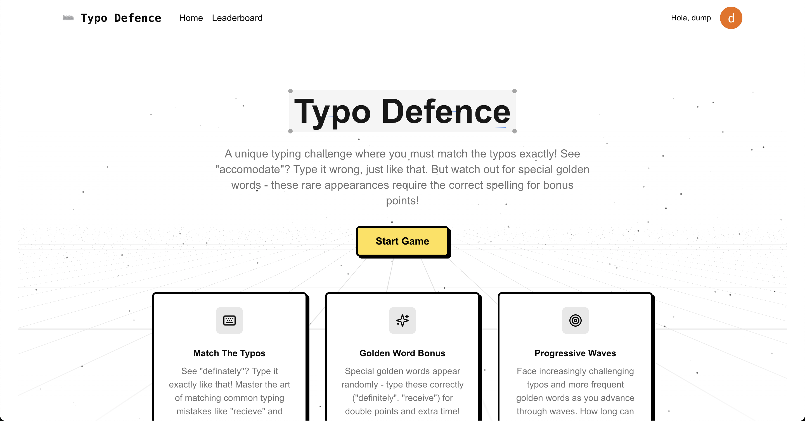

# Typo Defence



> Master the Art of Imperfection

## Overview

Typo Defence flips traditional typing games on their head. Instead of correcting mistakes, you'll need to match common typos exactly while watching out for special golden words that demand perfect spelling. Race against time through progressive waves, where your ability to intentionally misspell words like 'definately' and 'seperate' is your greatest weapon.

## Features

- 🎯 Match common typos exactly to score points
- ✨ Special golden words require perfect spelling for bonus points
- 🌊 Progressive wave system with increasing difficulty
- 🏆 Global leaderboard to compete with other players
- 🎨 Modern neubrutalism design
- 🔐 Secure authentication system

## Tech Stack

- **Frontend**: Next.js 14, React
- **Authentication**: Clerk
- **Database**: Amazon DynamoDB
- **Styling**: Tailwind CSS, Shadcn/UI
- **State Management**: Zustand
- **Animations**: Framer Motion

## Getting Started

First, run the development server:

```bash
npm run dev
# or
yarn dev
# or
pnpm dev
# or
bun dev
```

Open [http://localhost:3000](http://localhost:3000) with your browser to see the result.

## Requirements

- Desktop/Laptop device (not playable on mobile)
- Modern web browser
- User account (sign in required to play)

## Game Rules

1. Type the misspelled words exactly as shown
2. Watch out for golden words - these require correct spelling
3. Progress through waves of increasing difficulty
4. Compete for high scores on the global leaderboard

## License

This project is licensed under the MIT License - see the [LICENSE](LICENSE) file for details.

## Acknowledgments

- Thanks to the Next.js team for the amazing framework
- Shadcn/UI for the beautiful component library
- All our beta testers and early adopters

---

<p align="center">Made with ❤️ and intentional typos</p>
